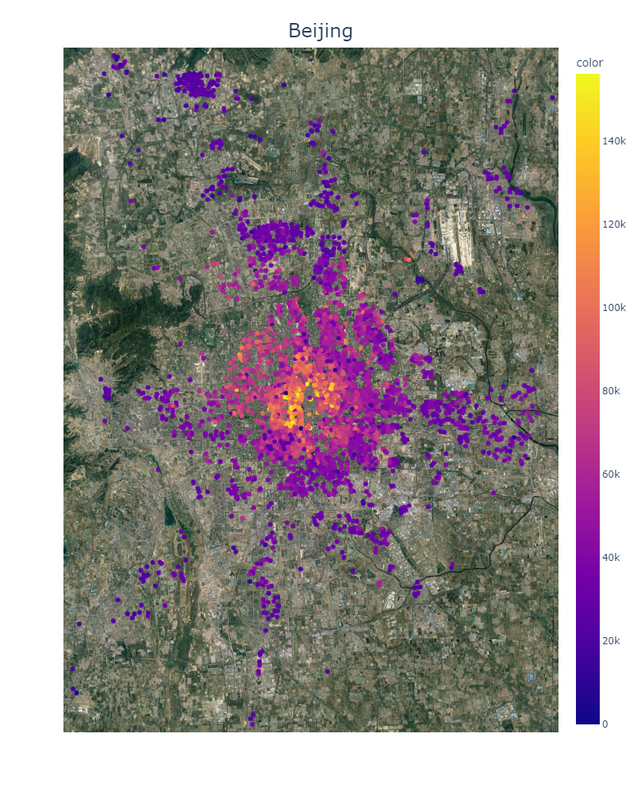

# Introduction
In this project we look into the housing prices of Beijing.
In the "analysis.ipynb" jupyter notebook we take a first look at the data.

# Data analysis
In this paragraph the analysis of the data gets documented.

The dataset used for this project is available on kaggle: [Link](https://www.kaggle.com/datasets/ruiqurm/lianjia)

## Column details
- url: the url which fetches the data
- id: the id of transaction
- Lng: and Lat coordinates, using the BD09 protocol.
- Cid: community id
- tradeTime: the time of transaction
- DOM: active days on market. Know more in https://en.wikipedia.org/wiki/Days_on_market
- followers: the number of people follow the transaction.
- totalPrice: the total price
- price: the average price by square
- square: the square of house
- livingRoom: the number of living room
- drawingRoom: the number of drawing room
- kitchen: the number of kitchen
- bathroom the number of bathroom
- floor: the height of the house. I will turn the Chinese characters to English in the next version.
- buildingType: including tower( 1 ) , bungalow( 2 )，combination of plate and tower( 3 ), plate( 4 ).
- constructionTime: the time of construction
- renovationCondition: including other( 1 ), rough( 2 ),Simplicity( 3 ), hardcover( 4 )
- buildingStructure: including unknow( 1 ), mixed( 2 ), brick and wood( 3 ), brick and concrete( 4 ),steel( 5 ) and steel-concrete composite ( 6 ).
- ladderRatio: the proportion between number of residents on the same floor and number of elevator of ladder. It describes how many ladders a resident have on average.
elevator have ( 1 ) or not have elevator( 0 )
- fiveYearsProperty: if the owner have the - property for less than 5 years,

## Column 'floor'
This column contains two informations -> one numeric value and chinese characters.
We have to investiagte and split thoose two informations.

# Visualizations
In this paragraph we look at some visualizations of the data.
## Map visualization of price

